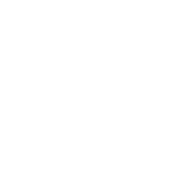

  

# Kookaburra

A fast, focused-mode terminal multiplexer for Claude Code sessions. Built in Rust with
wgpu + alacritty_terminal + glyphon + egui.

See [`KOOKABURRA.md`](./KOOKABURRA.md) for the full design handoff and
[`CLAUDE.md`](./CLAUDE.md) for the working guide and checklist.

## Status

Pre-alpha. Scaffolding only — see the checklist in `CLAUDE.md`.

## License

MIT OR Apache-2.0
